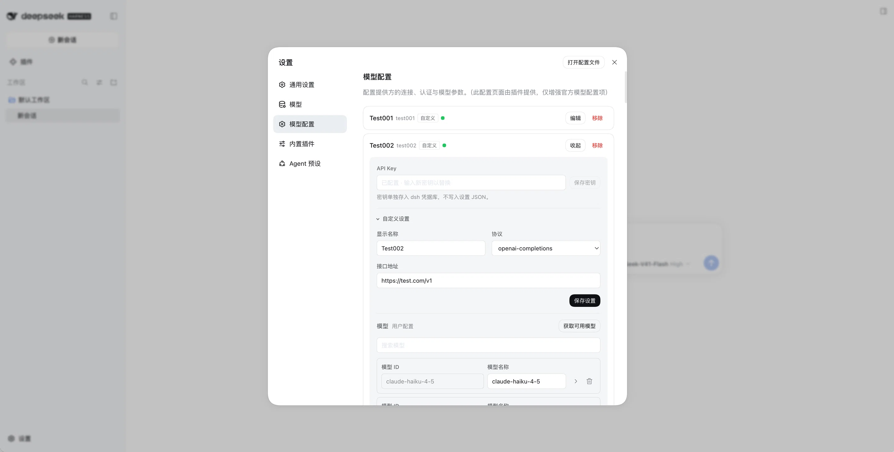
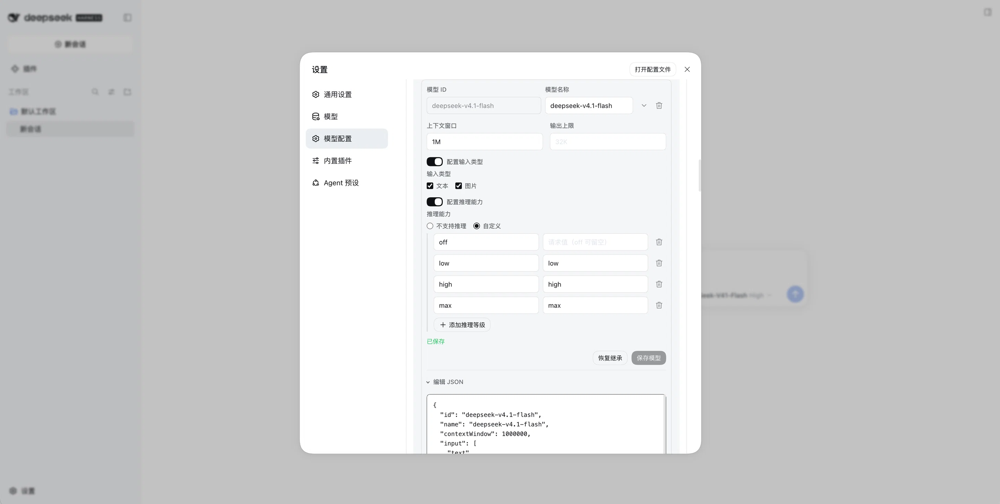

# dsh-custom-provider

[](LICENSE)

An independent provider and model configuration page for the built-in DeepSeek Harness `llm-pi-ai` adapter.

The plugin adds **Model configuration** below dsh's official **Models** section. It lets you manage provider profiles, API endpoints, credentials, model lists, and per-model overrides without modifying the official Models page or injecting content into its provider cards.

[简体中文](docs/README.zh.md)

## Why this plugin

dsh's built-in `llm-pi-ai` adapter owns the provider schema and runtime behavior. This plugin provides a focused settings surface for that existing namespace:

- Manage catalog providers and user-defined custom API routes in one page.
- Discover models through the adapter's model service before saving a custom provider.
- Edit common model capabilities or the selected model's JSON without replacing sibling models.
- Keep API keys in dsh's credential service instead of settings JSON.
- Preserve dsh's revision and schema validation behavior for concurrent or invalid writes.

## Screenshots

Set up provider routes, endpoints, and credentials in one page:



Edit one model's capabilities and JSON without replacing its siblings:



## Requirements

- A dsh installation with the **Web Settings** surface enabled.
- The built-in `llm-pi-ai` plugin enabled in the same dsh profile.

This package does not provide an LLM adapter, gateway route, or credential backend. It only manages the existing `llm-pi-ai` settings and remotes.

## Installation

Install the published plugin into the `web` profile:

```sh
dsh plugin --profile web add dsh-custom-provider
```

To install directly from the GitHub repository instead:

```sh
dsh plugin --profile web add github:xgblack/dsh-custom-provider
```

To install a local checkout, run this from the repository root:

```sh
dsh plugin --profile web add "$PWD"
```

Restart dsh, then open Web Settings and select **Model configuration** below **Models**.

The bundled patch registers the plugin once. Do not add another `dsh-custom-provider` entry with the same id.

## Quick start

1. Open dsh Web Settings and select **Model configuration** below **Models**.
2. Select **Add model provider**.
3. Choose a catalog provider, or choose **Custom model API** and enter a provider id, endpoint, and protocol.
4. Enter the API key when the provider requires one. Select models in the discovery dialog, or add model IDs manually when the endpoint cannot list models. Only added models enter the provider draft.
5. Save the provider and expand a model to edit its fields or JSON, or select **Fetch from models.dev** to import model metadata.

Custom providers must use an explicit protocol. **Inherit catalog** is available only for installed catalog providers.

## Capabilities

### Provider management

- Add installed catalog providers or define custom routes with an id, display name, endpoint, and protocol.
- Edit display name, endpoint, and protocol for writable provider fields.
- Remove user-created providers. Providers inherited from the profile composition cannot be removed from this page.
- Fetch and filter models using the adapter-owned `remote.llm` service. Recognizable official model IDs use installed pi-ai catalog metadata ahead of the provider response.
- For explicit model lists, both initial and repeat discovery use a model-selection dialog with nothing selected by default. Initial selection only updates the provider draft; on repeat discovery, only selected IDs not yet saved are appended. Fetching or cancelling never writes settings, and existing model entries remain unchanged. Catalog providers without an explicit list continue to refresh their displayed catalog.
- A custom provider can be created with manually entered model IDs when its endpoint cannot list models. At least one model is required; manual entries and selected discovery results share the same draft without replacing each other. An ID-only model uses the host defaults (text input, 256K context, 32K output), not verified upstream limits; adjust its fields after creation if needed.

### Model management

- Add and remove models in an explicit user-owned `models` list. The last model cannot be removed on its own: a custom route needs at least one model, while an empty list on an installed-catalog route would restore the entire catalog. Remove the custom provider separately if it is no longer needed.
- Use **Fetch from models.dev** to fill the editable name, context window, output limit, and supported text/image inputs. Review or adjust the fields, then click **Save model** to write them as user settings. Fetching alone does not save. Reasoning request values, `compat`, and other JSON fields are unaffected.
- Match the original full model ID first, then its recognizable official provider (such as `deepseek/…` or `openai/…`), then the first matching bare ID. A six-hour Web-memory cache serves repeated imports; a failed refresh leaves the model configuration unchanged.
- Customize installed catalog models through `modelOverrides.<model-id>` without copying the entire catalog.
- Edit model name, context window, output limit, input types, and reasoning capability.
- Reasoning levels come from the host schema, so the form offers exactly the levels `llm-pi-ai` accepts (`off`, `minimal`, `low`, `medium`, `high`, `xhigh`, `max`) and writes only the ticked ones. A level's request value is the wire spelling its gateway expects, and a blank `off` sends no reasoning parameter at all. A draft no adapter could serve — no level at all, a thinking level without a value, or `off` alone — is refused before the write, and a level key the host does not know is reported instead of rendered as a row, then removed by the next save.
- Use capacity values such as `256K` and `1M`.
- Open **Edit JSON** for the selected model only. The model id is fixed and sibling models remain untouched.
- Keep composition-inherited model lists read-only because editing one row would otherwise replace the complete inherited list.

## Data and write behavior

### Bulk provider transfer

Use **Export configuration** to select and download configured `llm-pi-ai` providers as a versioned JSON file, whether they were configured in this plugin, the official Models page, or the profile's base layer. The file contains each provider's effective profile, including explicit model lists, overrides, and advanced settings. Account sign-in (`deepseek-account`) and the built-in `deepseek-official` route are excluded. Unconfigured catalog entries and models available only through live discovery are not copied.

The export omits credential values and custom request headers. It retains `apiKeyEnv` reference names, so an imported route may use an existing credential with that name on the destination; check the reference and configure any missing key after import. Endpoint URLs can themselves contain sensitive parameters, so inspect and protect the JSON file accordingly. The destination's existing custom headers are never overwritten by an import because headers are outside the transfer boundary.

Use **Import configuration** to review the file before writing. Existing routes are skipped by default, so their model parameters are not changed until you choose **Replace all models** individually or use the bulk replacement action. Replacement writes every transferred provider field and replaces the complete model list, while preserving the destination's existing `headers`; fields absent from the source are removed from the destination user layer. New routes are selected by default. The preview identifies whether a route is new, user-configured, inherited, or layered, and shows the source and destination model counts. The selected routes are validated and submitted together with the current settings revision. Import never deletes unselected routes or changes stored credentials. A route whose effective source and destination profiles are identical produces no write. The destination's inherited layers and installed model catalog still determine the final effective configuration; an incompatible file is rejected rather than adapted silently.

The page follows the host `llm-pi-ai` schema and storage boundaries:

- Settings writes target the real `llm-pi-ai` namespace through revisioned `remote.settings` operations.
- Client-side schema validation runs before a mutation is sent to dsh. Host rejection and revision conflicts keep the unsaved draft visible.
- Explicit user model lists are replaced as a preserved array so hidden fields and sibling entries survive a single-model edit.
- Installed-catalog model edits write only the selected `modelOverrides.<model-id>` entry. Saving an object containing only its id restores the catalog default. A declared route not described by the installed catalog instead writes a complete `models` list; editing or importing an existing `modelOverrides` entry converts it into that list while preserving the other configured models.
- API keys are stored through `remote.credentials`, are never read back into a form, and are not written to settings JSON. Settings contain only the configured credential reference.
- If credential storage fails after a provider settings write, the key can be retried without creating another provider.

## Development

Node.js and npm are required for local development.

```sh
npm install         # development dependencies
npm run build       # regenerate lib/client.js
npm test            # build + focused checks
npm pack --dry-run  # inspect the published file set
```

Preview against an isolated profile, so test edits stay out of your normal dsh configuration:

```sh
preview_home="$(mktemp -d "${TMPDIR:-/tmp}/dsh-custom-provider.XXXXXX")"
DSH_HOME="$preview_home" dsh --profile web --patch "$PWD/test/local.patch.yml" --no-open --port 0
```

`lib/client.js` is generated from `lib/client.source.js`, `lib/config.js`, and `lib/modelsdev.js`, then committed because dsh loads it directly.

## Scope and limitations

- Only the built-in `llm-pi-ai` adapter is managed here. Other dsh adapters keep their own settings pages.
- This page is separate from the official Models page and includes some overlapping provider controls.

## Attribution and license

This project is a fork of [Luck9Star/dsh-gateway-provider](https://github.com/Luck9Star/dsh-gateway-provider). The MIT license and copyright attribution are in [LICENSE](LICENSE).

The project is released under the [MIT License](LICENSE).
