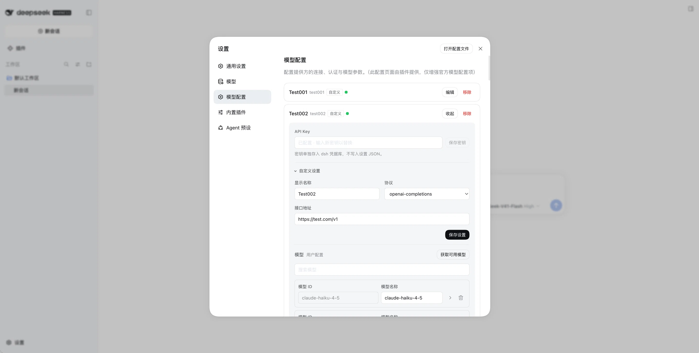
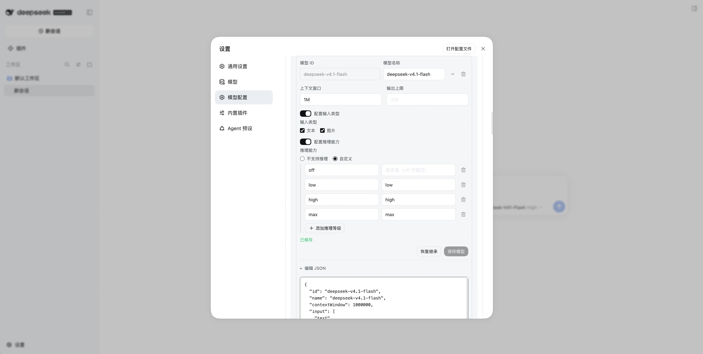

# dsh-custom-provider

[](../LICENSE)

这是 DeepSeek Harness 内置 `llm-pi-ai` 适配器的独立提供方和模型配置页面。

插件会在 dsh 官方「模型」设置下面增加「模型配置」，用于管理提供方配置、API 地址、凭据、模型列表和单模型覆盖项。它不修改官方「模型」页面，也不会向官方提供方卡片注入内容。

[English](../README.md)

## 为什么需要这个插件

dsh 内置的 `llm-pi-ai` 适配器负责提供方 schema 和运行时行为，本插件为现有命名空间提供专注的配置入口：

- 在一个页面管理目录提供方和自定义 API 路由。
- 保存自定义提供方前，通过适配器的模型服务发现可用模型。
- 编辑常用模型能力，或只编辑当前模型的 JSON，不替换其他模型。
- 通过 dsh 凭据服务保存 API Key，不把密钥写入设置 JSON。
- 保留 dsh 的 revision 和 schema 校验行为，正确处理并发或非法写入。

## 界面截图

在同一页面配置提供方路由、接口地址和凭据：



只调整当前模型的能力与 JSON，不替换同一提供方下的其他模型：



## 使用要求

- 已启用 **Web Settings** 的 dsh 安装。
- 与 Web Settings 使用同一个 dsh profile 的内置 `llm-pi-ai` 插件。

本项目不提供 LLM 适配器、网关路由或凭据后端，只管理现有的 `llm-pi-ai` 设置和远程服务。

## 安装

将已发布的插件安装到 `web` profile：

```sh
dsh plugin --profile web add dsh-custom-provider
```

也可以直接从 GitHub 仓库安装：

```sh
dsh plugin --profile web add github:xgblack/dsh-custom-provider
```

如需安装本地源码目录，在仓库根目录执行：

```sh
dsh plugin --profile web add "$PWD"
```

重启 dsh，然后在 Web Settings 的「模型」下面进入「模型配置」。

bundle patch 已经注册一次插件，不要再添加相同 id 的 `dsh-custom-provider` 条目。

## 快速开始

1. 打开 dsh Web Settings，在「模型」下面进入「模型配置」。
2. 点击「添加模型供应商」。
3. 选择目录提供方，或选择「自定义模型 API」，填写提供方 ID、地址和协议。
4. 如果提供方需要 API Key，先填写密钥，再获取可用模型。
5. 保存提供方，展开模型编辑字段或 JSON，也可以点击「从 models.dev 拉取」导入模型信息。

自定义提供方必须明确选择协议。「继承目录」仅适用于已安装的目录提供方。

## 功能

### 提供方管理

- 添加已安装的目录提供方，或创建带有 ID、显示名称、地址和协议的自定义路由。
- 编辑可写提供方的显示名称、地址和协议。
- 删除用户创建的提供方；profile composition 继承的提供方不能在本页删除。
- 通过适配器的 `remote.llm` 服务获取和筛选模型。可识别的官方模型优先采用 pi-ai 已安装目录的信息，其余字段取自提供方返回值。
- 重新获取模型时，以已有用户配置为准，并保留本次提供方列表未返回的模型。

### 模型管理

- 在用户显式维护的 `models` 列表中添加和删除模型。
- 「从 models.dev 拉取」，将名称、上下文窗口、输出上限及支持的文字／图片输入填入当前模型的编辑表单。核对或调整后点击「保存模型」才会写入用户配置；拉取本身不保存。推理请求值、`compat` 和其他 JSON 字段不受影响。
- 按原始完整模型 ID、可识别的官方提供方键（如 `deepseek/…` 或 `openai/…`）、首个同裸 ID 条目的顺序匹配。Web 内存缓存有效期为六小时；缓存过期且刷新失败时，模型配置不变。
- 通过 `modelOverrides.<模型 ID>` 覆盖已安装目录模型，不复制整份目录。
- 编辑模型名称、上下文窗口、输出上限、输入类型和推理能力。
- 推理等级取自宿主 schema，表单只提供 `llm-pi-ai` 接受的档位（`off`、`minimal`、`low`、`medium`、`high`、`xhigh`、`max`），并且只写入勾选的档位。每档的请求值就是该网关线上的拼写，`off` 留空表示请求里不带推理参数。适配器无法服务的草稿——一个档位都没勾、思考档没填请求值、或只声明 `off`——会在写入前被拒绝；宿主不认识的档位不会被渲染成一行，而是单独标出，并在下次保存时移除。
- 上下文窗口和输出上限支持 `256K`、`1M` 等容量写法。
- 在当前模型内打开「编辑 JSON」，模型 ID 固定，不影响同一提供方下的其他模型。
- composition 继承的模型列表保持只读，避免编辑一行时接管整份继承列表。

## 数据与写入行为

### 批量迁移提供方

点击「导出配置」可选择多个已有用户配置的提供方，下载带版本号的 JSON 文件。文件包含用户层的提供方配置、模型列表、覆盖项和高级设置；仅存在于继承层的提供方、仅由安装目录提供的模型不会复制。

导出不包含凭据值与自定义请求头，但保留 `apiKeyEnv` 引用名。因此导入后可能使用目标环境中同名的既有密钥；请核对引用并重新配置缺失密钥。接口地址本身也可能包含敏感参数，应检查并妥善保管 JSON 文件。依赖自定义请求头的路由需要重新配置请求头。

点击「导入配置」后先预览再写入。同名路由默认跳过，只有逐项选择「覆盖」才替换其用户层配置；新路由默认选中。所选路由经校验后携带当前设置 revision 一次提交。导入不会删除未选中的路由，也不会修改凭据库。最终生效配置仍受目标环境的继承层和安装目录影响；不兼容的文件会被拒绝，不会静默改写。

页面遵循宿主 `llm-pi-ai` 的 schema 和存储边界：

- 设置写入真实的 `llm-pi-ai` 命名空间，并通过带 revision 的 `remote.settings` 操作提交。
- 提交前执行客户端 schema 校验；宿主拒绝或 revision 冲突时保留未保存草稿。
- 用户显式配置的模型列表会作为保留其他字段和同级模型的完整数组提交。
- 目录模型只写当前的 `modelOverrides.<模型 ID>`；只保存包含 ID 的对象即可恢复目录默认值。
- API Key 通过 `remote.credentials` 保存，不回显、不写入设置 JSON；设置中只保存凭据引用名。
- 如果提供方设置写入成功但凭据保存失败，可以重试密钥，不会重复创建提供方。

## 开发与验证

本地开发需要 Node.js 和 npm。

```sh
npm install         # 安装开发依赖
npm run build       # 重新生成 lib/client.js
npm test            # 构建 + 重点检查
npm pack --dry-run  # 检查发布文件集合
```

在独立 profile 中预览，避免测试改动影响日常 dsh 配置：

```sh
preview_home="$(mktemp -d "${TMPDIR:-/tmp}/dsh-custom-provider.XXXXXX")"
DSH_HOME="$preview_home" dsh --profile web --patch "$PWD/test/local.patch.yml" --no-open --port 0
```

`lib/client.js` 由 `lib/client.source.js`、`lib/config.js` 和 `lib/modelsdev.js` 生成并提交，因为 dsh 会直接加载它。

## 范围与限制

- 本项目面向内置 `llm-pi-ai` 适配器；其他 dsh 适配器由各自的设置页面管理。
- 本页面独立于官方「模型」页面，两者有部分重叠的提供方控制项。

## 致谢与许可

本项目 fork 自 [Luck9Star/dsh-gateway-provider](https://github.com/Luck9Star/dsh-gateway-provider)。MIT 许可证与版权归属见 [LICENSE](../LICENSE)。

本项目使用 [MIT License](../LICENSE) 发布。
